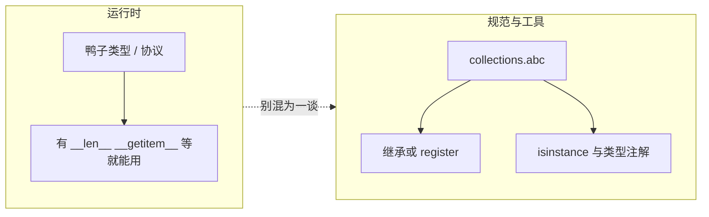
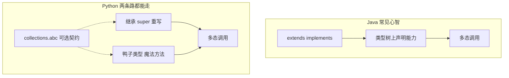

# Python 容器 API：`collections.abc` 与抽象基类（ABC）

> 《流畅的 Python》核心脉络：用 **`collections.abc`** 理解 **容器协议（接口）**、**鸭子类型**、**特殊方法** 三者关系；与 UML 里「Iterable / Sized / Container → Collection → Sequence|Mapping|Set」的常见画法一一对应。

---

## 新手零基础：鸭子类型、ABC、虚拟子类（分开讲 + 最短例子）

先记住一句总逻辑（后面各节都是把它展开、加细节）：

- **鸭子类型**：管**能不能运行**（干活）。
- **ABC**：管**有没有一套可对照的标准**（规矩）；**只有你选择继承「带抽象方法的 ABC」时，才会变成硬约束**。
- **虚拟子类**：**登记身份**——**不是** `class C(Parent)` 那种真继承；**一般也拿不到**对方类体里的实现代码，主要影响 **`issubclass` / `isinstance`** 这类「认不认账」。

---

### 新手-1：鸭子类型（最好懂，先学这个）

**人话**：**不看你爸爸是谁，只看你会不会干活**；有对应魔法方法，就能参与对应语法。

```python
# 没有继承 list，也没有继承任何 ABC
class MyList:
    def __len__(self) -> int:
        return 10


obj = MyList()
print(len(obj))  # 10
```

**看懂这三点就行**：

1. `MyList` **没有**写 `class MyList(list): ...`。  
2. 只实现了 **`__len__`**。  
3. 解释器照样让 **`len(obj)`** 工作。  

👉 这就是 **鸭子类型**：**会干活就行**，继承树不是第一顺位。

---

### 新手-2：ABC（定规矩的「抽象模板」）

**人话**：ABC 像**说明书**：规定「想扮演某个抽象角色，**至少**要提供哪些方法」。下面用标准库里的 **`abc.ABC` + `abstractmethod`** 演示「继承 = 立硬规矩」，最容易一眼看懂（`collections.abc` 里的 `Sequence` 等也是同一套机制，只是方法更多）。

```python
from abc import ABC, abstractmethod


class ShowRule(ABC):
    @abstractmethod
    def show(self) -> None:
        ...


class A(ShowRule):
    def show(self) -> None:
        print("我遵守规矩")


A().show()
```

**如果继承却不实现抽象方法**（运行时会在实例化阶段失败）：

```python
class B(ShowRule):
    pass


# B()  # TypeError：抽象方法未实现（具体文案以版本为准）
```

**和鸭子类型怎么分？**

- **只写魔法方法、不继承 ABC**：照样能跑，**没人强迫你「考证」**（`FrenchDeck` 一路）。  
- **一旦 `class C(SomeABC)` 且抽象方法没齐**：**实例化**往往直接失败——**这时** ABC 才是「强制守规矩」。

---

### 新手-3：虚拟子类（登记身份，不是真继承）

**人话**：**代码里没有** `class Visitor(Ticket)`，但可以用 **`Ticket.register(Visitor)`** 告诉类型系统：「在 **`isinstance` / `issubclass`** 这层，把 `Visitor` 当作 `Ticket` 的虚拟子类」。**注意**：`register` **不等于**把父类里的实现「拷贝」进子类；也不保证 `Visitor` 真有 `Ticket` 要求的方法——**它主要管「身份认不认」**。

下面用**自定义小 ABC**演示，避免和 **`Sized.__subclasshook__`（会自动认有 `__len__` 的类）**搅在一起：

```python
from abc import ABC, abstractmethod


class Ticket(ABC):
    @abstractmethod
    def price(self) -> int:
        """示意：抽象票种必须能报价格。"""
        ...


class Visitor:
    """普通游客：与 Ticket 无继承关系，也没实现 price。"""
    role = "visitor"


v = Visitor()
print(isinstance(v, Ticket))  # False：未登记

Ticket.register(Visitor)
print(isinstance(v, Ticket))  # True：虚拟子类登记后，isinstance 认账
```

**看懂三点**：

1. `Visitor` **全程没有写继承 `Ticket`**。  
2. **`register` 是「打标签」**：主要影响 **`isinstance` / `issubclass`**。  
3. **别和鸭子类型混谈**：业务方法能不能用，看协议；**`isinstance` 认不认**，看继承 / `register` / `__subclasshook__`（第七节还会提醒）。

> **对照 `collections.abc`**：`Sequence.register(YourClass)` 同理；而像 **`Sized`** 这类常带 **`__subclasshook__`** 的 ABC，**有时不等 `register`，`isinstance` 也会为 True**——以你本机为准。

---

### 新手-4：一秒区分（背诵用）

| 概念 | 一句话 | 管什么 |
| :--- | :--- | :--- |
| **鸭子类型** | 有方法就能参与 `len` / `[]` / `for` … | **运行时干活** |
| **ABC（继承抽象模板）** | 抽象方法不齐，**常常实例化失败** | **硬规矩（你自愿继承才生效）** |
| **虚拟子类（`register`）** | 不继承，只登记；**`isinstance` 可能变 True** | **身份 / 类型圈地** |

### 新手-5：终极比喻（图一乐，别当真考证）

- **鸭子类型**：你会做饭，客人就能点你的菜——**先不管证**。  
- **ABC（继承抽象模板）**：考证大纲写明必须会什么，**不达标就不发证**（实例化失败）。  
- **虚拟子类**：**没去上那门继承课**，但在系统里**登记一下身份**，查证件时显示「符合某条标准」——**登记的是身份，不是把别人的厨艺下载到你身上**。

---

## 一句话吃透：**鸭子类型 + ABC**（《流畅的 Python》语境）

### 鸭子类型（Duck Typing）

> **口诀：长得像鸭子、走起来像鸭子、叫起来像鸭子，就当它是鸭子。**

1. Python 是动态语言：**不看出身（继承树），先看有没有对应的方法**（协议 / 魔法方法）。
2. 以 **`FrenchDeck`** 为例（与书中一致）：
   - 有 **`__len__`** → 能用 **`len()`**（**`Sized`** 这一路能力）。
   - 有 **`__getitem__`** → 常能 **索引、切片**；并常能驱动 **`for`**、以及 **`in`** 的某种回退路径（细节见下文第四节、第七节）。
   - **不必继承 `list`**，也能在**用法上**「像列表」——这就是 **协议编程**：靠约定的方法名表达行为，而不是靠「绑死父类」。

3. 一句话记本质：**不在乎你是谁（类名），只在乎你能干什么（方法集合）。**

### ABC（`collections.abc`）

ABC 用来描述 **「某类容器在标准里应该长什么样」**：例如 **`Sequence`**、**`Mapping`**、**`Set`** 等，都是**行为标准模板**（再配 mixin 给默认实现）。

1. **作用**：给鸭子类型 **「画标准、起名字」**，方便 **`isinstance` / `issubclass`**、类型注解、团队协作。
2. **常见两种接法**：
   - **主动继承**某 ABC：抽象方法没实现全，实例化前就会报错（契约更硬）。
   - **`SomeABC.register(MyClass)`**：**虚拟子类**，不改变继承链，只影响「类型系统认不认」。
3. **`isinstance(obj, Sequence)`**：检查 **「在类型层级上是否被认成 Sequence」**；**与「`for` 能不能跑」不是同一件事**（后者看运行时协议；且未 `register` 时，**不同 CPython 版本的 `__subclasshook__` 也可能让 `isinstance` 为 True**，以 **`12_collections_abc_minimal_demo.py`** 在本机打印为准）。

### 二者最关键区别（秒懂）

| | **鸭子类型（协议）** | **ABC（`collections.abc`）** |
| :--- | :--- | :--- |
| **管什么** | **运行时**：有没有方法、解释器肯不肯这么调用 | **规范与检查**：标准长什么样、`isinstance`、注解、可读性 |
| **`FrenchDeck`** | 不继承 `list`，照样 **`len` / `for` / 切片** | 可选用 **`Sequence.register`** 或 **继承 `Sequence`**，把「我是序列」写进类型世界 |

### 极简打通例（可先背这段再往下看细节）

```python
# 鸭子类型：只靠方法「能跑」
class Deck:
    def __len__(self) -> int:
        return 52

    def __getitem__(self, i):  # 示意：真实牌堆应 return self._cards[i]
        return i


deck = Deck()
len(deck)   # 52
deck[0]     # 0

from collections.abc import Sequence

# 「能跑」≠「isinstance 一定 False」：以你本机打印为准
print(isinstance(deck, Sequence))
```

**背法**：**代码能跑，靠鸭子类型；`isinstance` / 注解认不认，靠 ABC 与 `register`。** 更细的陷阱见第七节。

### 极简对比图（面试一句话）



**终极三句**：

1. **鸭子类型**：**看方法不看继承**；Python **运行时**主要靠它。
2. **ABC**：**定规矩、做检查、写注解**；工程里把「像」变成「可声明」。
3. **关系**：**鸭子类型负责干活，ABC 负责立规矩**；二者互补，不是二选一。

---

## 附读：逐句拆透 + Python / Go / Rust 对照（进阶）

> 目标：把「语法糖 → 魔法方法」「ABC 强不强约束」「和 Go / Rust 像不像」**一次对齐**；仍与上文 **第四节（`in`）**、**第七节（陷阱）** 互补。

### 附读-1：鸭子类型——理解正确，再精确半步 ✅

> 只要实现了对应协议方法，就能参与对应语法/API；**解释器按数据模型派发**，**不先查继承树**，这是 Python 鸭子类型的底色。

常见派发（示意，不等价于阅读 C 源码的每一步）：

- **`len(obj)`** → 调 **`obj.__len__()`**（`Sized` 这一路）。
- **`obj[0]` / 切片** → 调 **`obj.__getitem__(...)`**。
- **`for x in obj`**：通常先走 **`iter(obj)`** → 优先 **`__iter__`**；若不存在合适的迭代器，仍可能退回到 **`__getitem__(0,1,2,…)`** 的「序列式迭代」（因此**忌**把 `for` 一句话说成「只等于调 `__iter__`」——与 **`isinstance(..., Iterable)`** 也不是同一条线，见第七节）。

---

### 附读-2：`collections.abc` 里的 ABC 到底是什么？

#### 定义

**ABC = 描述「行为契约」的抽象模板**：规定「某一类抽象角色**至少**要提供哪些方法」。例如：

- **`Sized`**：通常要求能回答长度 → **`__len__`**。
- **`Sequence`（读侧）**：读序列常见组合 → **`__len__` + `__getitem__`**（再叠加 mixin 给你 `index`/`count` 等）。

#### 「强不强制」分两种（都在 Python **运行时**发生）

1. **不继承任何 ABC、只写魔法方法（如 `FrenchDeck`）**  
   - **零强制**：不实现 ABC 也能跑；解释器只认「有没有对应方法」。

2. **直接 `class C(SomeABC)` 且 `SomeABC` 带未实现的抽象方法**  
   - **强约束**：类似 Java/C# 的抽象类型，但 Python 仍在 **import / 实例化等运行时步骤**报错（**不是**像静态语言那样在「编译期」卡你）。例如：

   ```python
   from collections.abc import Sequence

   class MySeq(Sequence):
       pass

   MySeq()  # TypeError：抽象方法未实现（具体文案以版本为准）
   ```

#### ABC 怎么「体现标准」？常见三条路

1. **继承 ABC**：抽象方法不齐 → **实例化（或类体检查策略依版本）**阶段失败，契约最硬。  
2. **在具体 ABC 上 `.register(Cls)`（虚拟子类）**：**不改 `Cls` 的继承链**，只让 **`issubclass` / `isinstance`** 等类型世界「认账」。写法是诸如 **`Sequence.register(FrenchDeck)`**，不是笼统一句「`abc.register()`」——**`register` 挂在各个 ABC 类上**（`collections.abc` / `typing` 各自规则略有差别，以文档为准）。  
3. **`__subclasshook__`**：让某些 ABC 在未继承时，也能按「类上是否具备某组方法」自动参与 `issubclass` 判定 → 你看到的 **`isinstance` 版本差异**，往往来自这里。

#### 和 Java / C#「接口」比，哪里像、哪里不像？

- **像**：都在描述**行为契约**（必须有哪些可调能力）。  
- **不像**：Python 仍允许 **纯鸭子类型**跑完全程；ABC / `register` / `__subclasshook__` 是**可选的「第二层」**，用来服务工程规范与类型检查。

---

### 附读-3：Python 鸭子类型 vs Go 接口 vs Rust Trait（横向一眼）

| 维度 | **Python（协议 + 可选 ABC）** | **Go `interface{}`（结构类型）** | **Rust `trait`（为主）** |
| :--- | :--- | :--- | :--- |
| **何时认定「满足契约」** | **运行时**：有方法就能用；`isinstance` 另说 | **编译期**：方法集匹配即实现接口 | **编译期**：多数场景要 **`impl Trait for T`** |
| **要不要写 `implements` / `impl`** | 不要求；ABC 继承/`register` 可选 | **不写**：隐式实现 | **通常要写 `impl`**（另有 blanket impl 等进阶话题） |
| **更像什么心智** | **动态鸭子类型** + 可选「类型圈地」 | **静态鸭子类型** | **强静态接口 / 能力集** |

一句话横向记（背诵用，**粗粒度**）：

1. **Python 鸭子类型**：**运行时、动态**；「有方法就能跑」是第一性；**ABC 用来补标准、做检查、写注解**，不是跑业务逻辑的前提。  
2. **Go 接口**：**编译期、静态**；**隐式实现**接口，设计气质与 Python 鸭子类型**高度同源**，只是检查时机前移。  
3. **Rust `trait`**：**编译期、静态、零成本抽象**；默认 **`impl` 显式绑定**，整体更像「强契约接口」，别硬说成「和 Python 完全同一种鸭子类型」。

---

### 附读-4：终极串联（把附读-1～3 收成四条）

1. **API / 语法糖** → 数据模型 → **魔法方法派发**；**继承不是第一顺位**。  
2. **ABC** = 行为契约模板：**不继承就不强制**；**继承则运行时硬**；还可 **`register` / `__subclasshook__`** 参与「认不认」。  
3. **Python vs Go vs Rust**：**动态鸭子 vs 静态结构类型 vs 静态显式 trait**——差别主要在**检查时机**与**默认要不要写绑定**。  
4. **工程上**：业务先写协议（魔法方法），需要再把「像」升级成「可声明」时，再引入 **`collections.abc` + 类型注解 / `register`**。

### 附读-5：最简一句话收尾

- **鸭子类型**：**管运行**，有方法就能跑。  
- **ABC**：**管规范与检查**，补契约、做 `isinstance` / 注解；**可选强制**（继承 ABC 时）。  
- **对照**：**Go ≈ 静态版鸭子类型气质**；**Rust `trait` ≈ 静态强接口气质**（粗记即可，细节各读各语言规范）。

---

## 附读二：Python 继承 vs Java（结合鸭子类型，粗线条对比）

> 目标：回答「**Python 到底有没有正统 OOP 继承？**」以及「**为什么说 Python 可以不靠继承过日子**」——和上文 **新手零基础**、**一句话吃透**、**附读（Go/Rust）** 同一条故事线。

### 附读二-1：一句结论（先背这个）

- **Python**：**完整支持**类继承、多继承、重写、`super()`、多态——**和 Java 一样有「正统 OOP 继承」这一套**。  
- **差别在习惯与类型系统**：Java 写**类型安全的多态**时，日常更依赖 **`extends` / `implements`** 把能力写进**继承树**；Python **同样能这么写**，但还并行存在 **「鸭子类型」** 这条路：**不必**先造一个 `Animal` 接口，也能让不同类在同一个函数里「像多态一样」被调用。  
- **ABC（`collections.abc`）**：像是给 Python **补一层「可选的、接近 Java 接口的契约」**——**不是**运行时的唯一门槛。

（Java 侧当然也有 `Object`、反射、泛型上界等绕过手段；下面是**教材式对比**，不抠边角语法。）

---

### 附读二-2：Python 的正统继承（和 `extends` 同一气质）

```python
class Animal:
    def speak(self) -> None:
        print("动物叫声")


class Dog(Animal):
    def speak(self) -> None:
        print("汪汪")


Dog().speak()  # 汪汪
```

👉 **标准继承 + 重写 + 多态**，与 Java 的 `extends` / `@Override` **同一类心智**。

---

### 附读二-3：「离不开继承」vs「可以不用继承」

**Java（静态、名义类型为主）**：想让 `hello(x)` 在**类型检查友好**的前提下，对多种类型统一调用 `x.speak()`，常见写法是让它们**实现同一接口**或**继承同一抽象父类**——**能力绑定在类型声明上**的习惯更强。

**Python（动态 + 协议）**：**两套并存**：

1. **正统继承**：想写「Java 味」完全可以。  
2. **鸭子类型**：**无共同父类**，只要各自有 **`speak`**，就能进同一个函数：

```python
class Dog:
    def speak(self) -> None:
        print("汪汪")


class Cat:
    def speak(self) -> None:
        print("喵喵")


def hello(animal) -> None:
    animal.speak()


hello(Dog())
hello(Cat())
```

在 Java 里若 **`Dog`/`Cat` 不共享带 `speak()` 的接口或父类**，就很难在**保持同样简洁与静态检查**的前提下写出等价的 `hello`——这正是对比想强调的点（**不是**说 Java 语法上绝对做不到任何变通）。

---

### 附读二-4：把四个词收成闭环

1. **Python 有继承**：与 Java 同类的 OOP 工具箱。  
2. **Python 还有鸭子类型**：**协议 / 魔法方法**先保证「能跑」。  
3. **`collections.abc` / ABC**：给鸭子类型补 **「可声明的契约」**（继承、`register`、`__subclasshook__`）。  
4. **背一句**：**Java 日常更常先把类型钉在继承树上；Python 可以先协议跑起来，再决定要不要钉 ABC。**

### 附读二-5：Java vs Python 两条路线（一眼图）



### 附读二-6：极简背诵（接在附读-5 后面记）

1. Python **有完整继承**；**不是**「没有 OOP」。  
2. Java：**名义类型 + 静态检查**习惯里，**接口/父类**往往是多态主入口。  
3. Python：**继承 + 鸭子类型**并行；**ABC** 给第二条补「像接口一样的标准」。  
4. **Python 继承 ≈ 学 Java 时的正统 OOP**；**鸭子类型 ≈ Python 数据模型自带的自由捷径**。

---

## 一、三大基础能力（容器的最小接口）

所有「像容器」的对象，都可以从三个维度问：**能不能迭代、有没有长度、能不能做 `in`**。

1. **`Iterable`**
   - **能力**：可迭代（`for`、`*` 解包、`iter(obj)` 等路径之一成立即可）。
   - **对应方法**：优先 **`__iter__`**；历史上若只有 **`__getitem__`**（整数下标 0,1,2…），解释器仍可能通过「序列式迭代」驱动 `for`（与 `Iterable` 的 `isinstance` 检测**不是**同一条规则，见第七节）。

2. **`Sized`**
   - **能力**：`len(obj)`。
   - **对应方法**：`__len__`。

3. **`Container`**
   - **能力**：`x in obj`。
   - **对应方法**：显式 **`__contains__`** 最理想；未实现时可能退化为 **`__iter__` 遍历**，再退化为 **`__getitem__` 按索引遍历**（见第四节）。

**广义容器（`Collection`，以当前 `collections.abc` 为准）**

- 可理解为 **`Collection` ≈ `Iterable` + `Sized` + `Container`**：能 `len()`、能 `for`、能 `in` 的对象，在抽象层面都可归入「广义容器」讨论。

---

## 二、三大容器分支（Sequence / Mapping / Set）

### 2.1 接口体系（概念）

| ABC 接口 | 代表类型 | 核心特点 | 必须方法（抽象侧，以标准库为准） | 常用 mixin（继承后可「白嫖」） |
| :--- | :--- | :--- | :--- | :--- |
| **Sequence** | `list`、`tuple`、`str` | 有序、整数索引、切片 | `__getitem__`、`__len__` | `index`、`count`、`__contains__`、`__reversed__` 等 |
| **Mapping** | `dict`、`defaultdict` | 键 → 值 | `__getitem__`、`__iter__`、`__len__` | `keys`、`values`、`items`、`get` 等 |
| **Set** | `set`、`frozenset` | 无序、去重、集合代数 | `__contains__`、`__iter__`、`__len__` | `&`、`|`、`-`、`^`、`<=`、`<` 等 |

### 2.2 重要补充

- **`dict` 有序**：CPython 3.7+ 起语言规范保证 **`dict` 插入有序**；抽象上仍是 **Mapping**，**不是** Sequence（没有「整数位置」的 `deck[i]` 语义，也没有序列式切片）。
- **`reversed()`**：与 **`Reversible`** / `__reversed__` 天然合拍的是 **Sequence** 这一路；Mapping / Set 的「反序」没有统一标准语义，不要硬套。

---

## 三、鸭子类型 vs ABC：「像」≠「是」

### 3.1 核心思想（《流畅的 Python》重点）

> Python **不强制**继承 ABC：只要实现了**对应特殊方法**，对象往往就能参与 `len` / `for` / `in`。  
> **`isinstance` / `issubclass`** 是**类型层级上的判断**（含 `__subclasshook__`、`register` 等），**不是**「这段代码运行时会不会报错」的完整替代。

### 3.2 以 `FrenchDeck` 为例（经典）

```python
import collections

Card = collections.namedtuple("Card", ["rank", "suit"])


class FrenchDeck:
    ranks = [str(n) for n in range(2, 11)] + list("JQKA")
    suits = "spades diamonds clubs hearts".split()

    def __init__(self):
        self._cards = [Card(r, s) for s in self.suits for r in self.ranks]

    def __len__(self) -> int:  # → Sized
        return len(self._cards)

    def __getitem__(self, i):  # → 索引、切片；并常驱动「序列式」for
        return self._cards[i]
```

#### 用法（「像」序列）

```python
deck = FrenchDeck()
len(deck)  # 52
deck[0]  # Card(rank='2', suit='spades')
deck[::2]  # 切片
for card in deck:
    ...
# 成员检测：元素是 Card，应与 Card 比较（不要误以为 'J' in deck 一定为 True）
Card("J", "spades") in deck  # True
```

#### 类型检查（关键区别）

```python
from collections.abc import Sequence, Iterable, Sized

# 以下结果以「你本机 CPython 大版本」为准：ABC 的 __subclasshook__ 可能随版本调整
isinstance(deck, Sized)  # 通常 True（有 __len__）
isinstance(deck, Iterable)  # 现代版本常 True（仅 __getitem__ 也可能被识别）
isinstance(deck, Sequence)  # 未继承、未 register 时：可能 True，也可能 False——不要死记
```

### 3.3 为什么会扯上 `__subclasshook__`？

- 许多 ABC 带 **`__subclasshook__`**：在**未显式继承**时，也能按「类上是否挂有某组方法」把第三方类判成虚拟子类。
- 例如 **`Sized`** 常只盯 **`__len__`**；**`Sequence`** 会盯 **`__getitem__` + `__len__`** 等组合。
- 规则可能微调 → **不要用 `isinstance(x, Iterable)` 代替「能不能迭代」的工程判定**；更稳的是 **`iter(x)`** 或 **`try` / `except TypeError`**（见第七节）。

### 3.4 显式声明 ABC（工程规范）

需要 **IDE / 类型检查器 / 文档契约** 更明确时：

```python
from collections.abc import Sequence

# 方式 1：继承 ABC（必须实现抽象方法，由 ABC 保证形状）
class FrenchDeck(Sequence):
    def __len__(self): ...
    def __getitem__(self, i): ...

# 方式 2：register 虚拟子类（不改变继承链，只影响 issubclass / isinstance）
Sequence.register(FrenchDeck)  # 若类已存在且不便改基类
```

---

## 四、`in` 操作的底层逻辑（精读）

对 **`item in obj`**，CPython 大致顺序为：

1. 若有 **`__contains__`** → 调用它（复杂度取决于实现：可能是 O(1)、O(log n)…）。
2. 若无 **`__contains__`**，但有 **`__iter__`** → 在迭代上比较（常见 O(n)）。
3. 若再退回 **`__getitem__`** → 按 `0, 1, 2, …` 取下标直到 `IndexError`（常见 O(n)）。

**工程建议**：自定义容器若频繁做 **`in`**，应**显式实现 `__contains__`**，避免无意中的全表扫描。

---

## 五、为什么要学 `collections.abc`？

1. **更 Pythonic 的设计**：先想「要暴露哪些**特殊方法** / 协议」，而不是先想「继承哪棵树」。
2. **类型注解更通用**：

   ```python
   from collections.abc import Sequence

   # 好：接受 list / tuple / str / 自研序列等
   def process(seq: Sequence[int]) -> None: ...

   # 坏（过窄）：只接受 list
   def process(seq: list[int]) -> None: ...
   ```

3. **读源码 / 第三方库**：NumPy、pandas 等大量 API 与「序列 / 映射 / 集合」协议对齐，认识 ABC 更容易读类型签名与 mixin 行为。
4. **自定义容器**：继承 **`Sequence` / `MutableSequence`** 等可**免费获得**大量 mixin 方法（`index`、`count`、部分 `__contains__` 逻辑等），减少样板代码。

---

## 六、可运行示例（与本节对照）

### 6.1 仓库自带：`12_collections_abc_minimal_demo.py`

同目录脚本：实现 **`__len__` + `__getitem__` + `__contains__`** 的 `MiniSeq`，分步打印 **`isinstance(..., abc.XXX)`** 以及 **`Sequence.register` 前后**的差异——专门用来钉死「**运行时能用**」和「**ABC 认不认**」不是一回事。

```bash
python part-1-data-structures/chapter-01/12_collections_abc_minimal_demo.py
```

### 6.2 最小 REPL 片段（仅 `__len__` + `__getitem__`）

```python
from collections.abc import Iterable, Sized, Container, Sequence, Mapping, Set


class MySeq:
    def __len__(self) -> int:
        return 10

    def __getitem__(self, i):
        return i


s = MySeq()
print("Sized      ->", isinstance(s, Sized))
print("Iterable   ->", isinstance(s, Iterable))
print("Container  ->", isinstance(s, Container))
print("Sequence   ->", isinstance(s, Sequence))  # 以本机为准
print("Mapping    ->", isinstance(s, Mapping))
print("Set        ->", isinstance(s, Set))
```

> **`Container`**：在无 `__contains__` 时，现代 CPython 的 `Container.__subclasshook__` 仍可能因存在 **`__iter__` / `__getitem__`** 而返回 True；与第四节「`in` 的实际查找顺序」合在一起记，避免背公式背拧。

---

## 七、面试高频陷阱

1. **`isinstance` ≠ 功能测试**
   - 能写 `for x in obj` 也不等于 **`isinstance(obj, Iterable)`** 一定为 True（历史上 `Iterable` 更强调 `__iter__`；与「序列式迭代」路径别混）。
   - 更稳的「可迭代吗」：**`iter(obj)`** 或 **`collections.abc` + 你项目约定的类型**。

2. **`Sequence` ≠「有序」的全部故事**
   - `dict` 3.7+ **插入有序**，但仍 **不是** Sequence（无整数位置索引 / 切片语义）。

3. **`__getitem__` 很强，但不是魔法**
   - 配合 **`__len__`** 常能驱动索引、切片、**序列式** `for`；**`in`** 仍可能走 **`__contains__` 或遍历**（第四节）。
   - 元素类型要与 **`in`** 的左操作数匹配：例如 **`Card('J', 'spades') in deck`**，不要想当然 **`'J' in deck`**。

4. **ABC 是接口契约，不是「默认实现大礼包」**
   - 继承 ABC 主要保证**方法集合**；真正省代码的是 **mixin**；未继承时**不会**自动获得 `index`/`count` 等。

---

## 八、与前面 `FrenchDeck` 笔记的关联（小结）

| 特殊方法 | 常见能力维度 | 与 `FrenchDeck` |
| :--- | :--- | :--- |
| `__len__` | **Sized** | `len(deck)` |
| `__getitem__` | 序列式访问；常驱动 **for** | `deck[i]`、切片、迭代 |
| `in` | **Container** 语义 / 或遍历回退 | 应对 **`Card`** 做成员检测，必要时自写 **`__contains__`** |

**不必继承 `list`**，也能在用法上「像序列」——这就是 **Python 数据模型 + 协议** 的精髓；**`collections.abc`** 则是把这套协议**说清、画全、写进类型系统**的工具箱。

---

## 附录：一页背诵用（可自行打印）

与 **「新手零基础」**、**「一句话吃透」**、**「附读：Python / Go / Rust」**、**「附读二：Python vs Java」** 四层粗对照呼应；展开细节仍以 **「一」～「八」** 各节为准。

- **三能力**：Iterable / Sized / Container → **Collection**。  
- **三分支**：Sequence / Mapping / Set。  
- **`in`**：`__contains__` → `__iter__` → `__getitem__` 下标扫。  
- **鸭子类型**：能跑 ≠ `isinstance`；契约用 **继承 ABC** 或 **`register`**。  
- **命令**：`python part-1-data-structures/chapter-01/12_collections_abc_minimal_demo.py`
