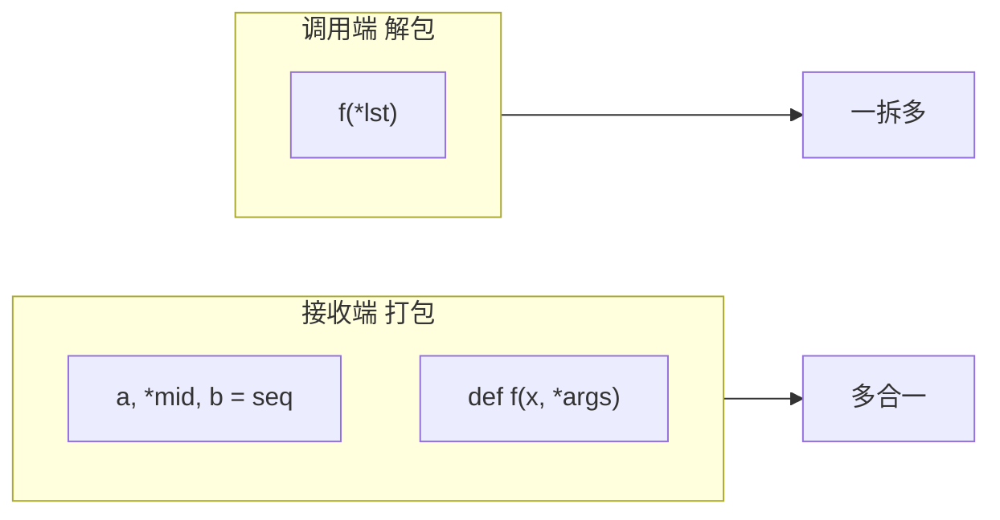

# 元组与拆包：把“索引操作”写成“字段读取”

元组（`tuple`）最常见的误解是：它只是“不可变的 list”。  
在实际代码里，`tuple` 更常被当成“结构化记录（record）”来用：一组位置固定、每个位置都有含义的数据。

拆包（unpacking）就是“按字段读记录”的语法：它让你少写 `t[0] / t[1] / t[2]` 这种脆弱的索引代码。

---

## 一、一句话结论（纠正最常见误解）

- **把 tuple 当作“不可变列表”**：你关注的是“装东西”，顺序通常不是语义的一部分。
- **把 tuple 当作“结构化记录（record）”**：你关注的是“字段含义”，**每个位置都承载语义**，顺序是数据的一部分。

---

## 二、两种用法的分界线（选型关键）

| 用法 | 核心特点 | 关键要求 |
| :--- | :--- | :--- |
| **不可变序列** | 仅作为容器，避免被意外修改 | 顺序往往不承载字段语义 |
| **结构化记录** | 用位置表达字段含义（像“无字段名的记录”） | **项数固定、顺序不可乱**（排序会破坏语义） |

---

## 三、作为“记录”的典型例子

### 1. 经纬度：顺序就是语义

```python
# (纬度, 经度) —— 一旦颠倒，意义就变了
lax_coordinates = (33.9425, -118.408056)
```

### 2. 一条城市统计记录：拆包是“读取字段”的首选方式

```python
# (城市名, 年份, 人口(千), 人口变化(%), 面积(km²))
city, year, pop, chg, area = ("Tokyo", 2003, 32_450, 0.66, 8014)
```

你应该把它读成“把记录的各字段取出来”，而不是“对一个不可变列表做解构”。

### 3. 护照信息列表：每个 tuple 都是一条记录

```python
traveler_ids = [
    ("USA", "31195855"),
    ("BRA", "CE342567"),
    ("ESP", "XDA205856"),
]
```

---

## 四、遍历 + 拆包：把索引访问变成“字段访问”

核心思想：
遍历列表 / 元组时，不要用下标 [0]、[1]，而是直接拆包成变量名，读起来像 “字段”，清晰不易错


### 1. 直接把 tuple 喂给格式化：位置对应字段

```python
for passport in sorted(traveler_ids): #sorted 会按元组第一个元素（国家代码）字典序排序
    print("%s/%s" % passport)
```
输出：

BRA/CE342567

ESP/XDA205856

USA/31195855


- 不用写 passport[0]、passport[1]；

- 格式串和 tuple 位置一一对应，直观。

### 2. 只取需要字段：用 `_` 作为占位符

```python
for country, _ in traveler_ids:
    print(country)
```

规则很简单：当某个位置的值你不会用，就用 `_` 显式丢弃它，读起来最干净。

---

## 五、星号 `*`：总纲（收 vs 散）+ 并行赋值里的「余下项」

### 5.0 一句话总纲（先背这个，后面都是展开）

**`*` 在常见教材里可以收成两种身份：**

1. **「接收端」**：出现在**并行赋值的左边**，或 **`def f(x, *args)` 的参数表**里 → 把多出来的东西**收进来、聚成一捆**（打包成 `list` 或元组 `args`）。  
2. **「发送端」**：出现在**函数调用**里，如 **`f(*lst)`** → 把序列**拆开**，变成**多个独立实参**（解包、打散）。

**极简口诀**：**接收端上的 `*`：收进来（打包）**；**调用里的 `*`：散出去（解包）**。

> 与下节关系：**第五节**主攻「赋值左边 + 余下项」；**第六节**主攻「函数定义里的 `*args` / 调用里的 `*iter` + 字面量里的 `*`」。

#### 对照表（背这个就不容易和第六节打架）

| `*` 出现的位置 | 直觉 | 动作 |
| :--- | :--- | :--- |
| **并行赋值左边**：`a, *rest, b = ...` | 有人拿头、有人拿尾，**中间全给 `*rest`** | **打包聚合** → 结果是 **`list`** |
| **函数定义参数**：`def f(x, *args): ...` | 固定参数以外的**所有位置实参** | **打包聚合** → 进 **`args` 元组** |
| **函数调用实参**：`f(*lst)` | 把 `lst` 当「一摞参数」摊平 | **解包打散** → 等价于 **`f(1, 2, 3)`** |



---

### 5.1 并行赋值：`*name` 捕获「余下的项」

Python 3 把 `*args` 的思想延伸到了**并行赋值**：`*name` 会捕获“剩余的所有项”，并打包成一个 **list**。

关键规则：

- **同一条赋值语句只能有一个 `*` 变量**（否则语法错误）。
- `*` 变量可以放在**开头/中间/末尾**。
- `*` 捕获的结果**永远是 list**（不管原 iterable 是 tuple、range 还是生成器）。

典型「头、中间一兜、尾」：

```python
a, *rest, b = [1, 2, 3, 4, 5]
# a == 1，b == 5，rest == [2, 3, 4]  （中间全部收进 list）
```

### 5.1.1 `*` 放末尾（最常用）

```python
a, b, *rest = range(5)
assert (a, b, rest) == (0, 1, [2, 3, 4])  # 成立 → a=0, b=1, rest=[2,3,4]

a, b, *rest = range(2)
assert (a, b, rest) == (0, 1, [])  # 成立 → rest 收不到多余项时为 []
```

### 5.1.2 `*` 放中间/开头

```python
a, *body, c, d = range(5)
assert (a, body, c, d) == (0, [1, 2], 3, 4)  # 成立 → body=[1,2]，c、d 收最后两项

*head, b, c, d = range(5)
assert (head, b, c, d) == ([0, 1], 2, 3, 4)  # 成立 → head=[0,1]，后三项固定
```

### 5.1.3 只取首尾、忽略中间：`*_`

```python
first, *_, last = range(6)
assert (first, last) == (0, 5)  # 成立 → first=0, last=5，中间被 *_ 丢弃
```

---

## 六、`*` 在函数调用与序列字面量中的拆包（2.5.2 / PEP 448）

（承上 **§5.0 总纲**：本节对应表里的**「函数定义 `*args`」**与**「调用 / 字面量里的解包」**——**调用侧是散出去**。）

### 1. 函数调用：可以多次 `*` 拆包并自动拼起来

```python
def fun(a, b, c, d, *rest):
    return a, b, c, d, rest

assert fun(*[1, 2], 3, *range(4, 7)) == (1, 2, 3, 4, (5, 6))  # 成立 → 前四实参 + rest=(5,6)
```

### 2. 序列字面量：`[*it1, *it2, x]` 合并更直接

```python
assert [*range(4), 4] == [0, 1, 2, 3, 4]  # 成立 → 列表字面量里 * 摊平 range(4)

assert [*range(4), 4, *(5, 6, 7)] == [0, 1, 2, 3, 4, 5, 6, 7]  # 成立 → 两段可迭代拼成一条 list
```

注意：你可能在网上看到 `(*range(4), 4)` 这种写法（tuple 字面量拆包），它和上面的 list 形式语义一致：把多个可迭代对象“摊平”拼成一个新 tuple。

---

## 七、嵌套拆包（Nested Unpacking，2.5.3）

### 1. 核心思想（用大白话说）

**拆包不只能拆“一层”的列表/元组，还能拆「里面还套着元组/列表」的结构。**

规则可以记成一句：

> **左边“变量那一坨”的括号形状，要和右边数据的括号形状对得上**；对上了，就能一口气把多层里的值都拿出来，而不用写 `item[3][0]`、`coord = item[3]; lat = coord[0]` 这种层层下钻。

优点很实在：

- 读代码的人立刻知道：你要哪些字段、故意扔掉哪些字段。
- 少写中间变量，也少写错下标。

---

### 2. 经典例子：城市记录 + 经纬度嵌套

数据结构：每条记录是 `(城市名, 国家代码, 人口, (纬度, 经度))`。

```python
metro_areas = [
    ("Tokyo", "JP", 36.933, (35.689722, 139.691667)),
    ("Delhi NCR", "IN", 21.935, (28.613889, 77.208889)),
    ("Mexico City", "MX", 20.142, (19.433333, -99.133333)),
    ("New York-Newark", "US", 20.104, (40.808611, -74.020386)),
    ("São Paulo", "BR", 19.649, (-23.547778, -46.635833)),
]

print(f"{'':15} | {'latitude':>9} | {'longitude':>9}")
for name, _, _, (lat, lon) in metro_areas:
    if lon <= 0:
        print(f"{name:15} | {lat:9.4f} | {lon:9.4f}")
```

#### 一一对应（对照着看）

- `name` ← 每条记录的第 1 项（城市名）
- 第一个 `_` ← 第 2 项（国家代码），**下划线 = 我不要这个字段**
- 第二个 `_` ← 第 3 项（人口），同样忽略
- `(lat, lon)` ← 第 4 项**本身又是一个二元组**，所以在左边也写成**带括号的一对小变量**，再拆一层

---

### 3. 单元素拆包 = 强制“恰好一条”（自带校验）

当你**明确预期**“这里只能有一条记录”时，可以用**单元素拆包**：条数不对会立刻 `ValueError`，避免“悄悄拿错第一条”。

#### 列表：最常见

```python
record_list = [("Tokyo", "JP", 36.933, (35.689722, 139.691667))]

[record] = record_list  # ✅ 刚好 1 条，成功；record 就是里面那条元组
# [] → not enough values to unpack
# [a, b] → too many values to unpack
```

#### 元组：别忘了“单元素元组”的逗号

```python
record_tuple = (("Tokyo", "JP", 36.933, (35.689722, 139.691667)),)  # 外层末尾逗号：只有 1 个槽位

(record,) = record_tuple  # ✅ 正确：左边也要写成 (record,) 与“单元素”对称
```

实际项目里，常见写法还会套在函数返回值上（语义一样）：

```python
[record] = query_returning_single_row()
[[field]] = query_returning_single_row_with_single_field()
(record,) = query_returning_single_row()  # 若返回的是单元素 tuple
```

一句话：**`[x] = ...` / `(x,) = ...` 就是在说“这里必须恰好一个”，多一个少一个都不行。**

---

### 4. 必踩坑：结构必须严丝合缝

**左边怎么套括号，右边就得长什么样**；多一层、少一层、顺序乱了，都会 `ValueError`。

#### ❌ 少了一层括号（把嵌套坐标当成两个顶层槽位）

```python
name, _, _, lat, lon = metro_areas[0]
# 右边一共 4 个顶层槽位，第 4 个是 (lat, lon) 这一对，不是一个 lat、一个 lon
# → ValueError: not enough values to unpack（左边要了 5 个顶层名字，右边只有 4 项）
```

#### ✅ 括号对上

```python
name, _, _, (lat, lon) = metro_areas[0]
```

#### ❌ 顺序/形状乱套（第一个位置期望是元组，实际却是字符串）

```python
(lat, lon), name, _, _ = metro_areas[0]
# 第 1 项是 "Tokyo" 这种 str：左边却当成「长度为 2 的一对」来拆，形状不对
# → ValueError: too many values to unpack (expected 2)（把 str 当二元组拆时常见）
```

---

### 5. 再浓缩成 3 条（好记）

1. **嵌套拆包 = 左右“形状”一致**：嵌套在左边用括号表达出来。
2. **`_` 是忽略字段的惯例**，一眼看出你刻意不要什么。
3. **`[x] = ...` / `(x,) = ...` 强制恰好一条**，用来防静默错误。

---

### 6. 小练习（复制运行）

下面两题都是**可执行片段**：跑通后你对“形状对齐”会有肌肉记忆。

**练习 1：两层嵌套** — 一条记录里再套一对值。

```python
emp = (1001, ("Li", "Wei"), "RD")
hid, (family, given), dept = emp
assert hid == 1001 and family == "Li" and given == "Wei" and dept == "RD"  # 成立 → 工号、姓名对、部门一次拆完
```

**练习 2：三层嵌套** — 再往里多套一层 `(状态码, 数值)`。

```python
job = ("batch-1", ("ingest", (0, 12.5)))
batch, (task, (code, ms)) = job
assert batch == "batch-1" and task == "ingest" and code == 0 and ms == 12.5  # 成立 → 三层括号与右边一一对应
```

（可自行把 `job` 改成四层，练习“先在纸上画左右形状再写代码”。）

---

## 八、元组 vs 列表：工程选型边界

| 场景 | 推荐用 tuple | 推荐用 list |
| :--- | :--- | :--- |
| 结构化记录（坐标、配置项、返回多值） | ✅ 不可变 + 位置语义清晰 | ⚠️ 可变，易误改字段 |
| 动态集合（增删改频繁） | ❌ 不适合（不可变） | ✅ 适合 |
| 作为 `dict` 的键 / 放进 `set` | ✅ **前提：元素都可哈希** | ❌ 不可哈希 |

---

## 九、作为“不可变列表”：tuple 的价值与边界

### 1. 两个直接收益：意图清晰 + 更少开销

- **意图清晰**：看到 tuple，就知道它的槽位数不会变，减少“被意外修改”的风险。
- **性能与内存**：同长度下 tuple 往往更省内存；解释器也能对“固定长度”做更多优化。

（经验法则：**固定长度且不需要增删改** → tuple；**动态集合** → list。）

### 2. 关键认知：tuple 的不可变是“引用不可变”，不是“深不可变”

tuple 的不可变，主要是指 **槽位引用不可变**：你不能把某个位置“换成另一个对象”；但如果某个位置本身是可变对象（例如 list），它的内容仍然可以被修改。

```python
a = (10, "alpha", [1, 2])
b = (10, "alpha", [1, 2])
assert a == b  # 成立 → 值相等（结构相同）

b[-1].append(99)  # ✅ 可以：修改的是内部 list
assert a != b  # 成立 → 同一槽位里的 list 被改，相等性破坏
```

### 3. 可哈希性：tuple 能否当 `dict` key 的必要条件

- tuple **是否可哈希**，取决于它的元素是否都可哈希。  
- **包含可变元素（如 list / dict / set）** 的 tuple 通常不可哈希。

一个通用的判断方法是“试一下 `hash`”：

```python
def fixed(o):
    try:
        hash(o)
        return True
    except TypeError:
        return False

tf = (10, "alpha", (1, 2))  # 全不可变
tm = (10, "alpha", [1, 2])  # 含可变 list

assert fixed(tf) is True  # 成立 → 全不可变，可 hash
assert fixed(tm) is False  # 成立 → 含 list，不可 hash
```

### 4. 增量赋值 `+=`：列表多「原地」，元组多「新建」

（与《Python 编程：从入门到实践》等书中对 `+=` 的对比一致。）

**核心原因**：`list` **可变**，可以实现**原地**加法；`tuple` **不可变**，没有「原地改自己」这一说，`+=` 只能走**新建再绑定**的路线。

#### 列表 `list`：`a += [4, 5]` → 通常 **`id` 不变**

- 底层常走 **`__iadd__`**（in-place add），语义上接近 **`extend`**：在**原对象**上追加。
- 因此 **`id(a)` 一般不变**。

```python
a = [1, 2, 3]
id_before = id(a)
a += [4, 5]
assert id(a) == id_before  # 成立 → list += 原地，id 不变
assert a == [1, 2, 3, 4, 5]  # 成立 → 内容在原地扩展为五元
```

#### 元组 `tuple`：`t += (3, 4)` → **`id` 会变**

- 元组没有「原地加长」：`+=` 实际是 **`__add__` 拼出新 tuple**，再 **`t = 新对象`**。
- 因此 **`id(t)` 通常改变**。

```python
t = (1, 2)
id_before = id(t)
t += (3, 4)
assert id(t) != id_before  # 成立 → tuple += 建新对象，id 改变
assert t == (1, 2, 3, 4)  # 成立 → 变量 t 绑定到新元组
```

#### 一句话

- **`list +=`**：**原地改**（`id` 常不变）。  
- **`tuple +=`**：**建新再绑定**（`id` 常变）。  

用 `id()` 看一眼，就能把「原地 vs 重新绑定」钉死。

### 5. 经典谜题：`t = (1, 2, [30, 40])` 与 `t[2] += [50, 60]`

#### 现象：既抛 `TypeError`，列表却又变了

```python
t = (1, 2, [30, 40])
try:
    t[2] += [50, 60]
except TypeError:
    pass

assert t == (1, 2, [30, 40, 50, 60])  # 成立 → TypeError 后槽内 list 已被原地 += 扩展
```

#### 底层两步（背这个就永远不晕）

对 **`x[y] += z`**，语义上可理解成两步：

1. **读出来并原地改中间结果**：`temp = x[y]`，再执行 **`temp += z`**。  
   这里 `t[2]` 是 **list**，`temp += [50, 60]` 走 **list 的原地扩展** → **成功**，列表内容已经变了。  
2. **写回槽位**：执行 **`x[y] = temp`**。  
   外层 `x` 若是 **tuple**，槽位不能改绑 → **`TypeError`**。

于是出现：**第二步报错，但第一步已经把 list 改完了**。

#### 为什么「元组不可变」拦不住「里面的 list 在变」？

- 元组不可变的是**槽位里的引用**（不能换指向哪个对象），不是「被引用的对象内部不能变」。  
- `t[2]` 一直指向**同一个 list 对象**；变的是 **list 内部元素**，不违反 tuple 的「引用不变」。

**工程结论**：避免在「记录型 tuple」里塞可变对象；要动态用 `list`，或改用不可变嵌套结构。

### 6. 验证代码清单（复制即跑，对照 `id` 与谜题）

整脚本演示见：`04_tuples_as_records_and_unpaking_demo.py` 中的 **`demo_iadd_list_vs_tuple`**、**`demo_tuple_slot_iadd_puzzle`**。下面是一份**最小清单**，可直接贴进 REPL 或单文件运行：

```python
# --- 清单 A：list += 原地（id 不变）---
a = [1, 2, 3]
ia = id(a)
a += [4, 5]
print("list same id?", id(a) == ia, a)
assert id(a) == ia and a == [1, 2, 3, 4, 5]  # 成立 → id 不变且值为 [1..5]

# --- 清单 B：tuple += 新建（id 变）---
t = (1, 2)
it = id(t)
t += (3, 4)
print("tuple new id?", id(t) != it, t)
assert id(t) != it and t == (1, 2, 3, 4)  # 成立 → id 变且新元组 (1,2,3,4)

# --- 清单 C：谜题（TypeError 但 list 已变）---
t2 = (1, 2, [30, 40])
try:
    t2[2] += [50, 60]
except TypeError as e:
    print("TypeError:", e)
print("after puzzle:", t2)
assert t2 == (1, 2, [30, 40, 50, 60])  # 成立 → 第三项 list 已在 += 第一步被拉长
```

> **可运行对照**：`python part-1-data-structures/chapter-02/04_tuples_as_records_and_unpaking_demo.py`（含上述 A/B/C 的打印版）。

---

## 十、列表 vs 元组：接口差异与使用提示

### 1. 你真正需要的是“变长能力”吗？

- list 有 `append/extend/insert/pop/remove` 等**变长/原地修改**方法。
- tuple 不提供这些方法：它的优势就是“固定槽位、语义稳定”。

### 2. `reversed` 小细节

tuple 没有 `__reversed__` 实例方法，但 `reversed(my_tuple)` 仍可用（全局函数会走通用协议 / 回退到索引访问）。

---

## 十一、避坑（回到“记录视角”）

### 1. 禁忌：对“记录型 tuple”排序

如果 tuple 承载字段语义，排序会直接破坏语义（例如把 `(纬度, 经度)` 排成 `(经度, 纬度)` 这种荒谬结果）。

### 2. 需要字段名时，不要硬扛 tuple

当你发现自己经常要记 “第 3 位是啥”，就说明“纯 tuple 记录”已经到上限了：考虑 `namedtuple` / `typing.NamedTuple` / `dataclass`。

---

## 十二、学习关联（往后怎么接）

- 需要“记录”但又想有字段名：看 `collections.namedtuple` / `typing.NamedTuple`。  
- 需要更复杂的数据模型：看 `dataclasses.dataclass`（常与类型注解一起用）。  
- 深入理解 hashable 与可变性：回到 `02-容器序列与扁平序列.md` 的 hashable 小节。

---

## 十三、小练习（建议你用拆包写，而不是用索引）

1. **记录拆包**：给定 `record = ("Tokyo", 2003, 32450, 0.66, 8014)`，用拆包取出 `city` 和 `pop`（忽略其他字段）。  
2. **`*rest`**：给定 `seq = range(10)`，写出拆包：取 `first`、`last`，中间全部丢弃。  
3. **嵌套拆包**：给定 `r = ("X", (1, 2))`，拆包得到 `name=...`、`x=...`、`y=...`。  
4. **可哈希性判断**：分别构造一个“可哈希 tuple”与一个“不可哈希 tuple”，解释原因（提示：看内部是否含 `list/dict/set`）。  

**§七末尾**另有「两层 / 三层」两道**可复制运行**的断言小练，可与本题 3 对照。

可运行对照见：`04_tuples_as_records_and_unpaking_demo.py`。

